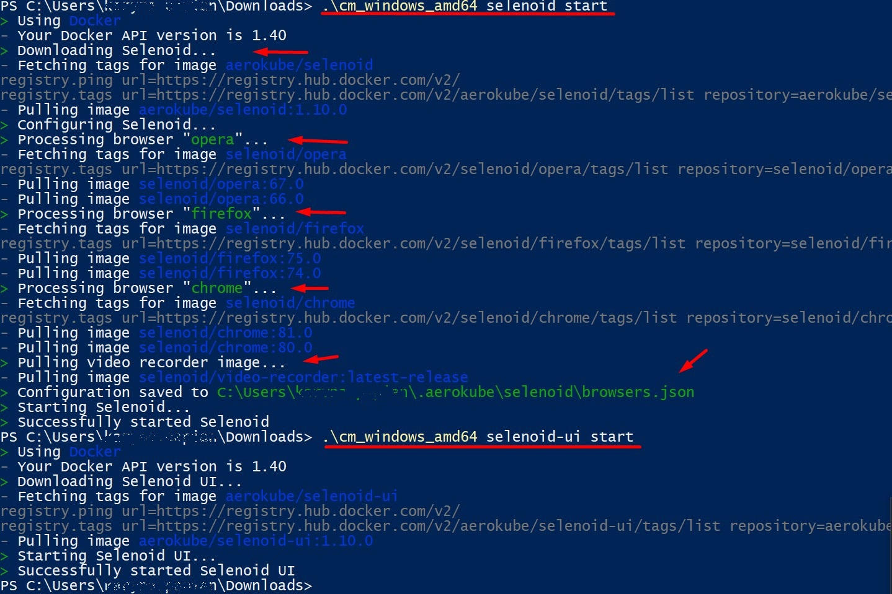

# Selenium WebDriver-TestAutomation framework.

Automation framework based on C#, Selenium WebDriver and NUnit.

## Pre-setup

1. Install all necessary browser, e.x. **Chrome Browser** or **FireFox Browser**
2. Install Visual Studio 2019

## Setup basic staff for test framework

1. Create project type NUnit test project (.Net core) or for .Net framework
2. Install via Manager NuGet packages:
   - NUnit
   - NUnit3TestAdapter
   - SeleniumSupport
   - SeleniumWebDriver
3. For running in different browsers you will need to download and add to your project:
   - chromedriver.exe
   - geckodriver.exe
   - operadriver.exe

## Run tests

Run tests via Visual Studio 2019 -> Test -> Test Explorer.

## Keep eyes on versions

1. driver.exe files
2. all packages in solution

## Quick Start Guide for Selenoid on workstation, virtual machine or server

Selenoid is a powerful Golang implementation of original Selenium hub code. It is using Docker to launch browsers.

1. Make sure you have recent Docker version installed.
2. Download Configuration Manager [Selenoid quick installation binary] (https://github.com/aerokube/cm/releases/tag/1.7.1) for your platform from releases page.
3. Run Docker
4. On Windows run one command to start Selenoid:

```powershell
.\cm_windows_amd64 selenoid start
```

5. Optionally run one more command to start Selenoid UI:

```powershell
.\cm_windows_amd64 selenoid-ui start
```



6. Check that Selenoid is running with opening status url:

```powershell
http://localhost:4444/status
```

7. To open Selenoid UI navigate to the following page in your browser:

```powershell
http://localhost:8080/
```
